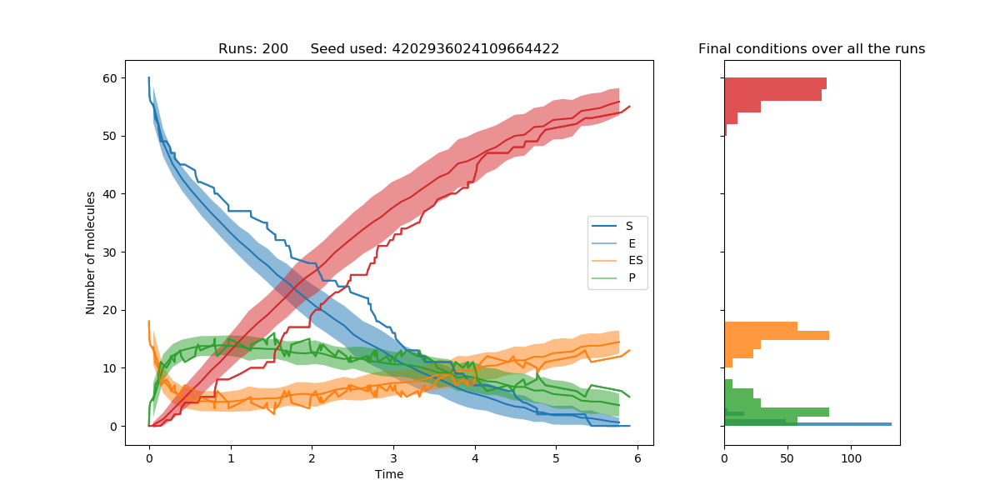
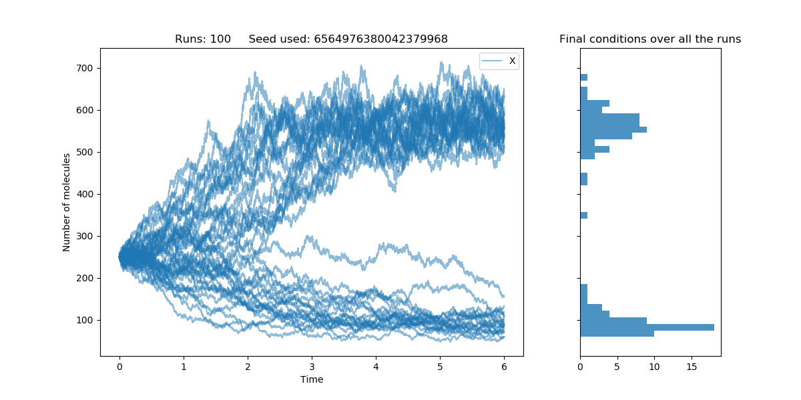
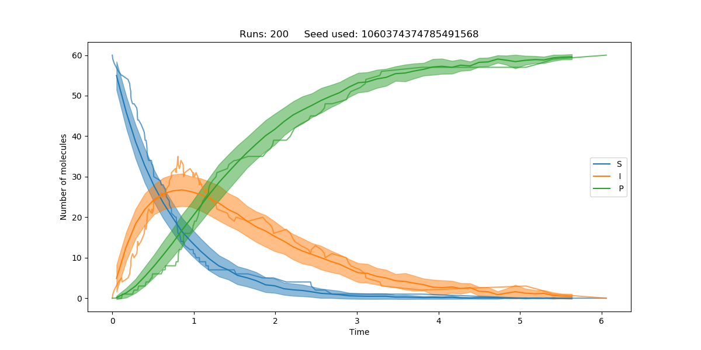

# Stochastic Chemical Kinetics

Stochastic chemical kinetics is the description of the time evolution of a chemical system using probabilistic mathematical models. As one reduces the size of the system being studied, treatment by differential equations is no longer satisfactory. This is because:
- the amount of reactant is now a discrete number
- the rate of reaction is no longer deterministic

The difference is not normally appreciated but in biological systems, with low populations of molecules, stochastic processes can have important roles.

## Examples
Here are a few examples of the sort of behaviour systems can exhibit and the way they can be graphed. Config files can be found in [Examples](https://github.com/JBQuim/stochastic-chemical-kinetics/tree/master/Examples) folder.

The Michaelis-Model of enzyme catalysis is as follows:

```
E + S -> ES
ES -> E + S
ES -> E + P
```

At low molecule populations the system can take very different paths as seen from the graph, which depicts the average, standard deviation and a single run. At the right is a histogram of the final states.



The schlogl model exhibits two steady state regimes. In a deterministic treatment of this system, the starting conditions determine what steady state the system will settle into. Treated in stochastic terms, the system is bistable and can evolve towards either steady state regime.

```
2X -> 3X
3x -> 2X
∅ -> X
X -> ∅
```



## Usage
### Setting up simulation
To simulate the time evolution of a system main.py is run with a config.txt file in the same directory. The config.txt file specifies both the simulation parameters and the type of output.

The steps to specify a system are best understood with an example. Take the system:

```
S -> I
I -> P 

with S₀ = 60, I₀ = 0, P₀ = 0
```

The species' names are first specified in `varnames`. The stochastic rate constants are specified in `c`. In all cases, numbers must be separated by commas.

Next, to specify the reactions themselves `stoichR` and `stoichP` must be modified. `stoichR` is the dependence of the rate of reaction on the amount of a given species. In this case, for the first reaction it is `1,0,0` and for the second is `0,1,0` so overall it can be written as `1,0,0, 0,1,0`. The spaces are not needed but make it more readable.. If there was a second order step it would be 2, etc. If the reaction is not an elementary step the value in `stoichR` need not match the stoichometry of the reaction. The change in amount of species that takes place when the reaction occurs is recorded by `stoichP`. In this case it is `-1,1,0, 0,-1,1`.

To finish defining the system, `n0` is a list of the starting conditions of every species. Here `60, 0, 0`.

The rest of the simulation parameters are:
- `Tf` - time at which the simulation will be stopped
- `maxEvents` - number of events (reactions) at which the simulation will be stopped
- `runs` - number of times the simulation is run, the results can then be graphed in various ways
- `seed` - the seed used to generate random numbers, if `-1` a random seed will be chosen

### Graphing options
The results of the various simulations that have been run can be displayed in various ways:

- As individual lines. 
- As the average of all the runs (with or without their standard deviation)
- As a scatter graph of all the states throughout all the runs
- With a histogram to show the final state over all the runs

All these options can be combined to achieve the graphs seen before.

To graph the average of all runs, set `averages = True`. `segmentCount` is the number of samples per run, taken when doing the average. Because only a few runs reach the very extremes in time, changing `percent` lets you take the average only for some percentage of the longest run. If at 100%, the ends of the average can be fairly noisy, due to only very few runs having gotten that far. By setting `deviations = True`, the standard deviation will be plotted as a shadow.

To plot a scatter graph set `scatter = True`.

Individual runs can be plotted by setting `lines` to some number. If `-1`, all the runs will be displayed.

To plot a histogram of the final states set `histogramAmounts = True`. The amount of bins for each species must be provided separated by commas.

Finally, to save as png file set `save = True`. Note it'll need a folder called `Images` to save to.

If everything's right, for this system you might get something like this:



## Theory

The method used to simulate the time evolution of the system is as follows. Every event j (reaction) is given a propensity, `aⱼ`. Events have no memory and so are exponentially distrubuted in time with probability density function `exp(-aⱼt)`. i.e. the time til the next event `j`, `Tⱼ`, is given by `P(Tⱼ>t) = exp(-aⱼt)`. A more intuitive view of the propensity can be arrived at by looking at `Tⱼ` when taking a small timestep `Δt`. 

``` 
P(Tⱼ>Δt) = exp(-aⱼΔt)

P(Tⱼ>Δt) = exp(-aⱼΔt) = 1-aⱼΔt + ...

which implies

P(Tⱼ≤Δt) = aⱼΔt
```
for very small `Δt`. The propensity can therefore be taken as the probability per unit of time of a given event happening.

The Gillepsie algorithm is what's used to simulate the time evolution of the system. It goes as follows:

1. Initialize the system with the starting conditions
2. Calculate the propensity of each reaction
3. Find the time til next reaction and decide which reaction occurs
4. Update the simulation according to the effects of the chosen reaction
5. If the final time has not been reached, return to step 2.

Step 3 could be performed by computing `Tⱼ`, by drawing a random number from `exp(-aⱼΔt)`. If done for every event, then the event with the lowest `Tⱼ` occurs. The approach taken here is different, as it requires less numbers to be randomly generated. Let `a₀` be the propensity that *any* event occurs. It is simply the sum of the propensities of all events. We generate the time til next event using this propensity. Then we choose which event occured, given the time til next reaction. This is done by realizing that `P(Event J) = aⱼ/a₀`. This method then requires the generation of only two random numbers.

For more information regarding Gillepsie's algorith, other algorithms and  a more exhaustive treatment of the theory of stochastic chemical kinetics refer to "Stochastic Approaches for Systems Biology".
